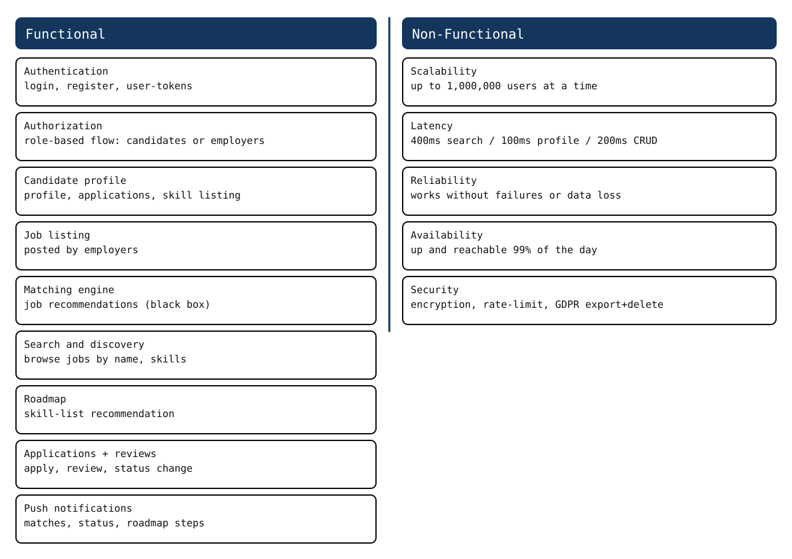
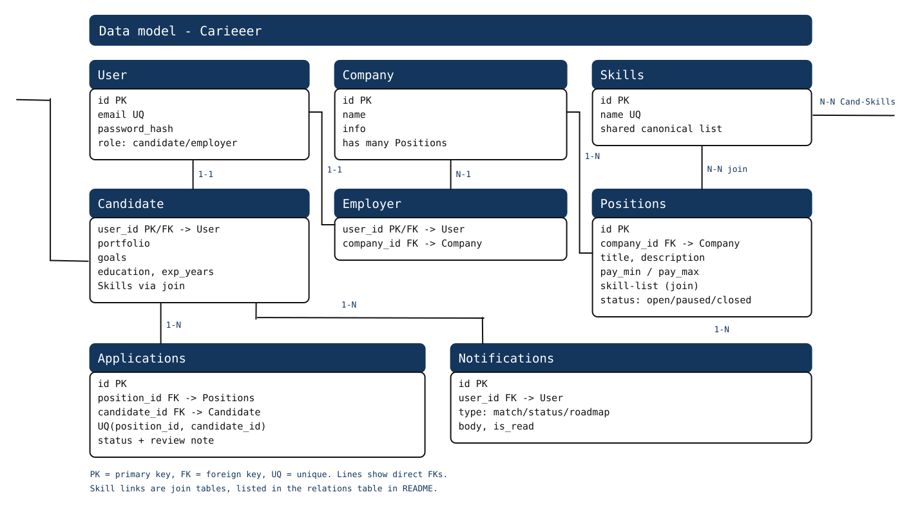
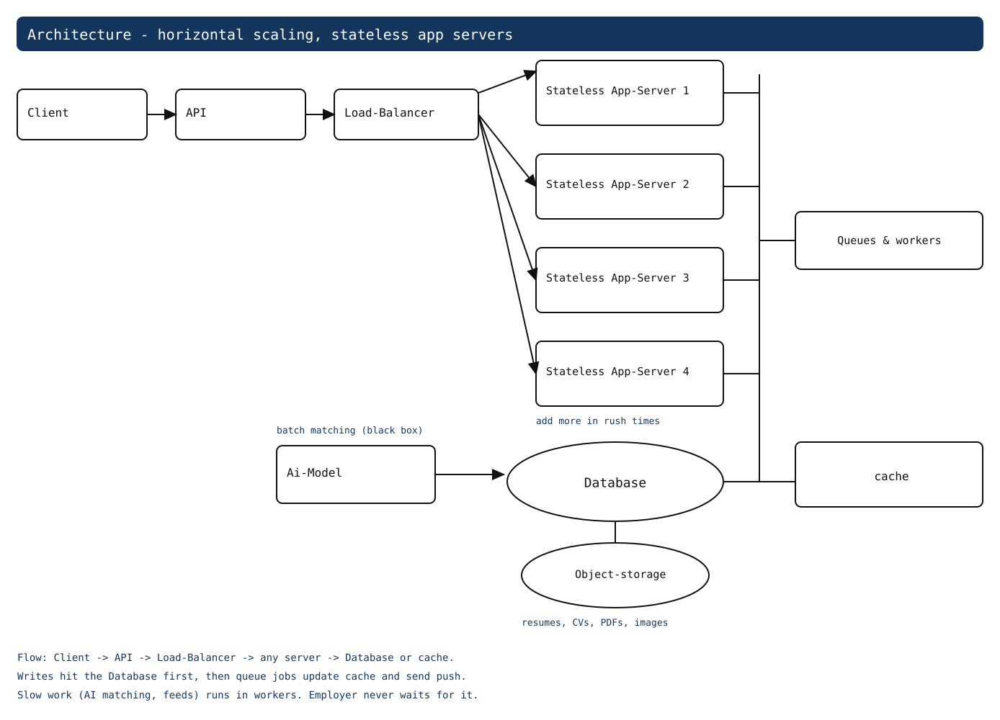
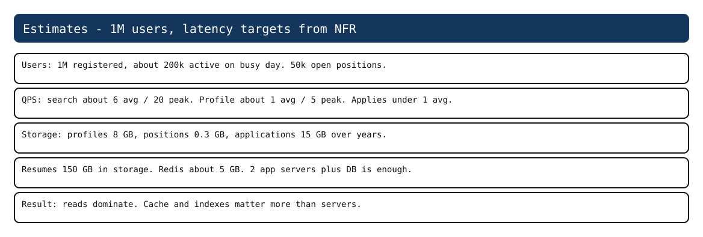

# Carieeer - System Design

Team: Victoris-Men8ir-Victories. Submission for CodeRefine Qualification 2.

Carieeer is a career site. Candidates make a profile, find jobs, apply, and see what skills they are missing. Employers post jobs, search candidates, and move applications through review. The matching engine is a black box for us. We send it candidate and job data, it sends back a ranked list.

This repo holds our design. Diagrams are in Excalidraw. Details for deep dives and estimates are in docs/.

## Contents

- Functional and non-functional requirements
- Data model
- API design
- High level architecture
- Deep dives: docs/deep-dives.md
- Estimates: docs/back-of-envelope.md

## 1. Functional requirements

What we built for:

- Authentication: login, register, user tokens
- Authorization and role based flow: candidates or employers
- User profile, job applications, skill listing from candidates
- Job listing from employers
- Matching engine and job recommendations
- Browsing, search and discovery for jobs
- Roadmap and skill-list recommendation
- Job applications and reviews
- Push notifications

We kept the list short on purpose. Each item maps to one API group below.

## 2. Non-functional requirements

- Scalability: site can handle up to 1,000,000 users at a time
- Latency: 400ms for search, 100ms for profile-details, 200ms for CRUD operations
- Reliability: the system keeps working correctly without failures or data loss
- Availability: the system stays up and reachable 99% of the day
- Security: encryption, rate-limiting, GDPR for export and deletion

We test latency on search, profile, and basic CRUD because those are what users feel. The rest is in docs/deep-dives.md.

Source: diagrams/01-functional-nonfunctional.excalidraw




## 3. Data model

Source: diagrams/02-data-model.excalidraw



Tables we use:

- User: id, email, password hash, role. One row per person. Role is candidate or employer.
- Candidate: user_id, portfolio, goals, education, experience. Linked to User.
- Employer: user_id, company_id. Linked to User and Company.
- Company: id, name, info, job-list. One company has many positions.
- Positions: id, company_id, title, description, pay range, skill-list, status. This is the job post. Status is open, paused, or closed. Only open shows in search.
- Skills: id, name. Shared list so candidate skills and position skills use the same names.
- Applications: id, position_id, candidate_id, status, review note, created_at. One row per apply. We add a unique key on (position_id, candidate_id) so a person cannot apply twice. Status goes Applied -> Screened -> Interview -> Offer -> Hired, or Rejected from any step.
- Notifications: id, user_id, type, body, is_read. For matches, status changes, and roadmap steps.

Relations:

| From | To | Type | Key |
| --- | --- | --- | --- |
| User | Candidate | 1-1 | Candidate.user_id PK/FK |
| User | Employer | 1-1 | Employer.user_id PK/FK |
| Employer | Company | N-1 | Employer.company_id FK |
| Company | Positions | 1-N | Positions.company_id FK |
| Positions | Skills | N-N | Position_Skills join table |
| Candidate | Skills | N-N | Candidate_Skills join table |
| Candidate | Applications | 1-N | Applications.candidate_id FK |
| Positions | Applications | 1-N | Applications.position_id FK |
| User | Notifications | 1-N | Notifications.user_id FK |

Notes:

- One user has one Candidate or one Employer profile, never both.
- Skill-list on Candidates and Positions is a join on skill id, not free text.
- UQ(position_id, candidate_id) on Applications stops double applies. That is what returns 409.
- The diagram draws direct FK lines only. The two skill joins are in the table so the diagram stays readable.

In the diagram PK means primary key, FK means foreign key, UQ means unique.

## 4. API design

Source: diagrams/03-api-design.excalidraw

We use token auth. Client sends the token in the header. Most writes return EMPTY on success and the client reloads the list.

| endpoint | Type | Request | Response | Status Code |
| --- | --- | --- | --- | --- |
| POST /login | Auth | email, password | token data | 200 OK |
| POST /register | Auth | username, email, password, confirm-password, role | token data | 201 Created |
| DELETE /logout | Auth | token | EMPTY | 204 No Content |
| GET /profile | Profile | token | user-details | 200 OK |
| PATCH /profile | Profile | token, user-data | EMPTY | 200 OK |
| POST /profile/skills | Profile | token, skill-list | EMPTY | 201 Created |
| GET /jobs | Jobs | EMPTY | job-list | 200 OK |
| GET /jobs/show/{id} | Jobs | job-id | job-details | 200 OK |
| GET /jobs/matching | Jobs | candidate-skill-list | matching-jobs | 200 OK |
| POST /jobs/store | Jobs | job-details | EMPTY | 201 Created |
| GET /jobs/search | Jobs | job-name, job-skills | job-list | 200 OK |
| POST /jobs/apply/{job-id} | Jobs | job-id, user-token | EMPTY | 200 OK, 409 on duplicate |
| POST /jobs/review/{application-id} | Jobs | review-details | EMPTY | 201 Created |
| PATCH /jobs/status/{application-id} | Jobs | status | EMPTY | 204 No Content |
| GET /jobs/skill-gap/{job-id} | Jobs | user-token, job-details | skill-list | 200 OK |
| GET /notifications | Notifications | user-token | notification-list | 200 OK |
| POST /notifications | Notifications | notification-details | EMPTY | 201 Created |
| PUT /notifications/mark-read | Notifications | notification-id | EMPTY | 200 OK |

Notes from building it:

- POST /jobs/apply returns 409 if the same candidate applies to the same job twice. The DB unique key enforces this, not just app code.
- PATCH /jobs/status only allows the next valid status. Bad jumps return an error.
- GET /jobs/matching and GET /jobs/skill-gap call the matching black box. We pass skills and get back a ranked list plus missing skills.
- PUT /notifications/mark-read takes one notification-id and marks it read.

## 5. High level architecture

Source: diagrams/04-high-level-architecture.excalidraw



Parts:

- Client: web and mobile. Talks only to the API.
- API: entry point. Handles auth, profiles, jobs, applications, skill-gap, notifications.
- Load-Balancer: spreads requests across the app servers.
- Stateless App-Servers: run the code. Any server can take any request. We add more in rush times, like summer internships or after graduation when applications spike.
- Database: one shared central store. The servers are stateless so auth and all data live here. Holds users, profiles, companies, positions, skills, applications, notifications.
- Object-storage: large files. Resumes, CVs, job-description PDFs, images.
- cache: hot reads. Job feeds, popular title and skill searches, candidate target roles with their required skill lists, and matching job lists so the Ai-Model does not rerun on each request.
- Queues & workers: background work. Example: an employer posts a job, a worker runs AI matching for the best candidates and refreshes feeds. The employer never waits for it.
- Ai-Model: the matching black box. Reads jobs and candidates from the Database, results go back through workers into cache.

Flow:

1. Client -> API -> Load-Balancer -> any server -> Database or cache. Search must finish under 400ms, profile under 100ms.
2. Writes go to the Database first, then the API pushes a queue job. The worker updates cache and sends notifications. This keeps writes safe and slow work out of the request.
3. Matching refresh runs in workers on a schedule and when a profile or position changes. Results sit in cache so GET /jobs/matching is fast.

We picked horizontal scaling because the user count grows and rush times spike. If search gets hot we split it out first. More in docs/deep-dives.md.

## 6. Deep dives

Full text: docs/deep-dives.md

Short version:

- Scaling: one server bottlenecks on CPU, memory, and concurrent requests. Load balancer over stateless servers. Trade-off is more infrastructure complexity.
- Database and object storage: one central DB first for consistency, read replicas later for read traffic. Replicas can lag. Large files (CVs, resumes, PDFs, images) go to object storage.
- Cache: popular feeds, target roles with skills, job details, matching results. Trade-off is some stale data. TTLs plus invalidation on change. Refresh popular entries early to avoid stampedes.
- Queues & workers: AI matching runs in background so job creation returns fast. Scale workers by queue size. Trade-off is results are not immediate, plus retry handling.

## 7. Estimates

Full math: docs/back-of-envelope.md, diagram: diagrams/05-back-of-envelope.excalidraw



We planned for 1,000,000 users, 400ms search, 100ms profile, 200ms CRUD, 99% up. Reads dominate, so cache and indexes matter more than adding app servers.

## Repo layout

```
.
+-- README.md
+-- diagrams/
|   +-- 01-functional-nonfunctional.excalidraw
|   +-- 02-data-model.excalidraw
|   +-- 03-api-design.excalidraw
|   +-- 04-high-level-architecture.excalidraw
|   +-- 05-back-of-envelope.excalidraw
|   +-- *.svg
+-- docs/
    +-- deep-dives.md
    +-- back-of-envelope.md
```
